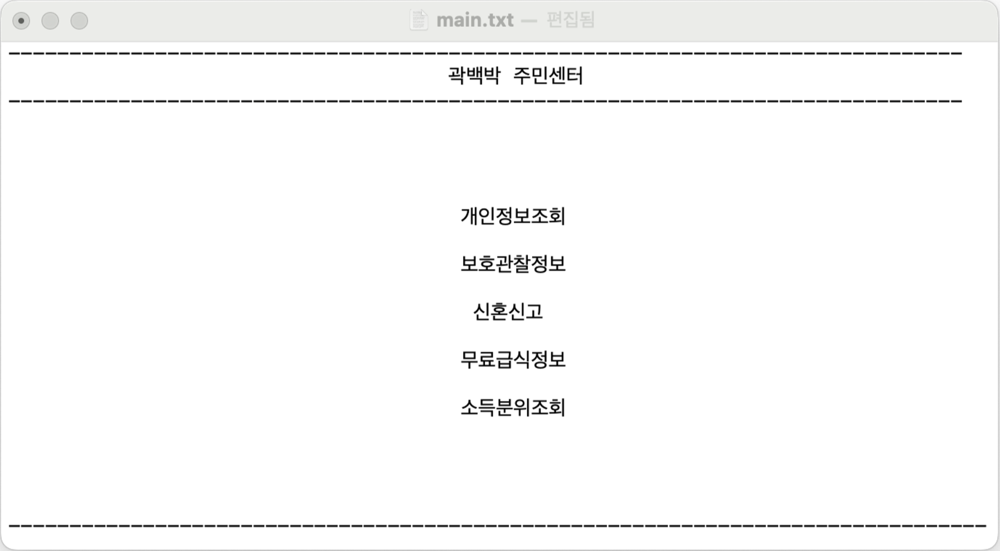
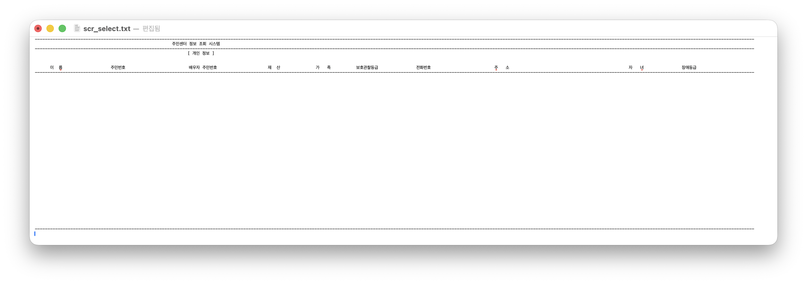
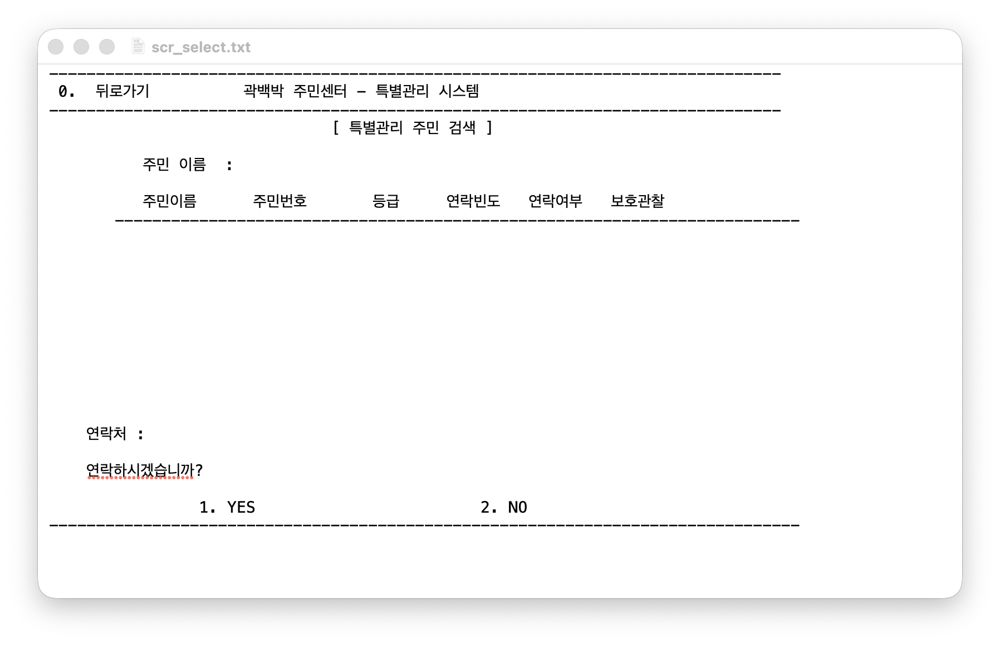
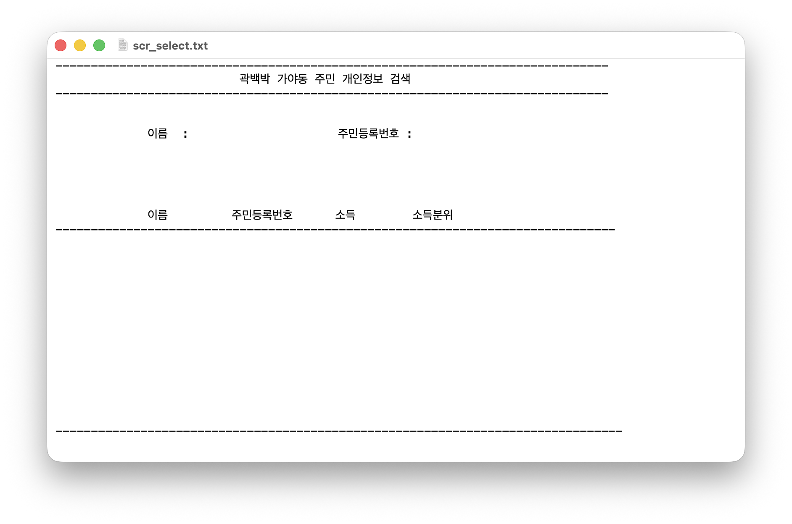

# 🏘️ 가야동 주민 관리 시스템 (Gaya-dong Resident Management System)

## 📝 프로젝트 개요
주민센터 행정 업무의 효율성을 높이기 위해 주민 정보 관리 및 맞춤형 복지 혜택 대상자를 조회·관리하는 시스템입니다.  
Oracle DB와 Pro*C(Embedded SQL)를 활용하여 대량의 주민 데이터를 효율적으로 필터링하고 복지 행정 처리를 자동화할 수 있도록 구현했습니다.

## 📅 프로젝트 기간
* 2018.11.12 ~ 2018.12.15

## 💻 기술 스택
* **Language**: C
* **Database & Tool**: Oracle DB, Pro*C (Embedded SQL)

## 🎯 프로젝트 목적 및 내용

### 1. 주민 정보 조회 및 데이터 관리 시스템 구축
Oracle DB와 Embedded SQL 기반으로 주민 데이터를 조회·관리할 수 있는 행정 시스템을 구현했습니다.

#### 주요 관리 정보
* 이름
* 주민등록번호
* 주소
* 전화번호
* 가족 정보
* 장애 등급
* 보호관찰 등급
* 소득 정보

동적 SQL(Dynamic SQL)을 활용하여 조건 기반 주민 조회 기능을 구현하고, 대량 데이터를 효율적으로 처리할 수 있도록 설계했습니다.

### 2. 복지 및 보호 대상자 관리 시스템 구현
특정 복지 자격 조건을 가진 주민을 검색하고 관리 상태를 업데이트할 수 있도록 구현했습니다.

#### 주요 기능
* 보호관찰 등급 대상자 조회
* 복지 대상자 필터링
* 연락 여부 기록 기능
* 관리 상태 자동 업데이트 기능

연락 횟수를 누적하여 일정 횟수 이상일 경우 중점 관리 대상자로 자동 전환되도록 구현했습니다.

```c
sprintf(dynstmt22,
    "update probation "
    "set p_contact_f = p_contact_f + 1, "
    "P_contact_pa = 'YES' "
    "where p_name like '%%%s%%' "
    "and rownum = 1",
    no_temp2);

EXEC SQL EXECUTE IMMEDIATE :dynstmt22;
EXEC SQL COMMIT WORK;
```

### 3. 소득분위 자동 분류 기능 구현
이름과 주민등록번호를 기반으로 주민 데이터를 검색하고 Oracle `CASE WHEN` 문을 활용하여 실시간 소득분위 분류 기능을 구현했습니다.

#### 소득분위 기준
* 1분위 : 월 0원 ~ 100만원
* 2분위 : 월 100만원 ~ 200만원
* 3분위 : 월 200만원 ~ 300만원
* 4분위 : 월 300만원 ~ 400만원
* 5분위 : 월 400만원 이상

#### 핵심 구현 코드
```c
/* 이름 및 주민등록번호 기반 소득분위 실시간 분류 쿼리 */
sprintf(dynstmt, 
    "SELECT j_name, j_social_num, j_sal, "
    "CASE WHEN j_sal BETWEEN 0 AND 100 THEN '1분위' "
    "     WHEN j_sal BETWEEN 101 AND 1000 THEN '2분위' "
    "     WHEN j_sal BETWEEN 1001 AND 10000 THEN '3분위' "
    "     WHEN j_sal BETWEEN 10001 AND 100000 THEN '4분위' "
    "     ELSE '5분위' END AS 소득분위 "
    "FROM jumin "
    "WHERE j_name LIKE '%%%s%%' "
    "AND j_social_num LIKE '%%%s%%'", 
    no_temp1, no_temp2);

EXEC SQL PREPARE S FROM :dynstmt;
```

## 🛠️ 주요 기능 및 코드 구조

### 1. 메인 시스템 및 DB 연동 (`main`)
#### `main.test.pc`
* Oracle DB 서버와 연결
* 호스트 변수를 통한 DB 접속 검증
* 시스템 초기화 및 주요 기능 호출

#### `main.txt`
* 외부 텍스트 파일 기반 화면 렌더링
* 콘솔 UI 출력 제어 기능 구현

### 2. 복지 및 보호 대상자 관리 (`disorder`)
#### `P_search`
* 복지 대상자 검색
* 보호관찰 등급 기반 조건 조회
* Dynamic SQL 기반 필터링

#### `Update_pro`
* 연락 횟수 증가 처리
* 관리 상태 자동 업데이트
* COMMIT 기반 데이터 반영

#### `scr_select.txt`
* `EXEC SQL FETCH` 기반 데이터 출력
* 페이지 단위 화면 처리(`PAGE_NUM`)
* 화면 버퍼 클리어 및 커서 제어 구현

### 3. 소득분위 분류 시스템 (`information`)
#### `new_select_xy.c`
* 이름 및 주민등록번호 입력 기반 검색
* `CASE WHEN` 기반 실시간 분위 분류
* 동적 SQL 처리 및 결과 출력

## 🖥️ 실행 결과

### 메인 화면


시스템 실행 시 주민 관리 기능과 조회 기능을 선택할 수 있는 메인 화면입니다.

### 데이터베이스 전체 조회 화면


Oracle DB에 저장된 주민 데이터를 조회할 수 있으며, 커서 기반 FETCH 방식으로 데이터를 출력합니다.

### 연락처 및 관리 상태 지정 화면


주민 이름 검색 후 연락 여부를 등록할 수 있으며, 연락 횟수 기반 관리 상태 업데이트 기능을 제공합니다.

### 주민번호 기반 소득분위 조회 화면


이름과 주민등록번호를 입력하면 시스템 내부 로직을 통해 실시간으로 소득분위를 계산 및 출력합니다.

## ⚠️ 프로젝트 문제점 및 한계

### 문제점 및 한계
1. 초기 구현 단계에서 개인정보 조회 범위가 넓어 실제 서비스 환경에서는 개인정보 보호 및 접근 권한 제어가 추가적으로 필요했습니다.

2. 콘솔 기반 UI 특성상 사용자 경험(UI/UX) 측면의 확장성이 제한적이었습니다.

3. 계절학기 프로젝트 특성상 시스템 아키텍처 및 보안 설계까지는 확장하지 못했습니다.

## ✅ 수정 및 보완 사항
* 개인정보 조회 기능 일부를 프로젝트 범위에서 제외했습니다.
* 주민 데이터 조회 범위를 최소화하여 개인정보 노출 가능성을 줄였습니다.
* 소득분위 자동 분류 기능을 추가하여 복지 행정 활용성을 강화했습니다.
